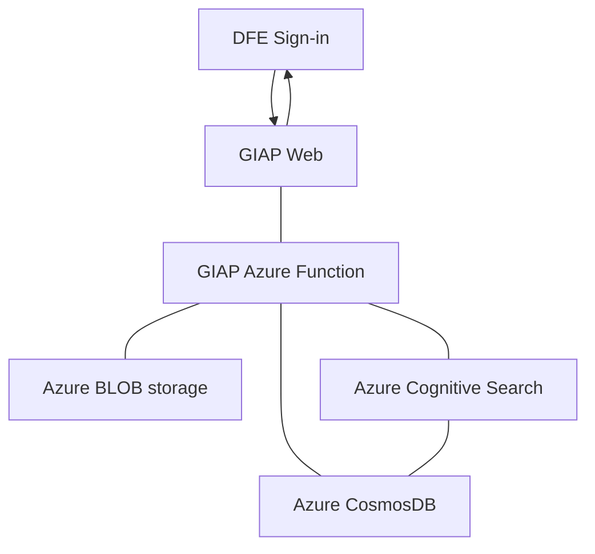

# Get Information About Pupils

GIAP (Get Information about pupils) is a replacement of the existing KtS (Key to Success) service that has been in operation for around 15 years. The GIAP service consists of a web application, a data pipeline, a database and set of Azure functions.

## Architecture

GIAP-Web relies on a set of Azure Functions in the GIAP.AzureFunctions application, these then query Azure Cognitive Services/CosmosDB for data. The initial access is granted via [DSI](https://services.signin.education.gov.uk/) which provides authentication and authorisation to the application.



## Getting Started / Setup

###	Installation process

Clone the repository on your local machine in a suitable location

```sh
git clone https://github.com/DFE-Digital/get-information-about-pupils
```

GIAP has been developed using .NET Core so you will need an appropriate IDE (or text file browser if you wish). Either Visual Studio Code (with .NET C# support) or Visual Studio would be preferable, this was developed using Visual Studio 2019/2022. 

Load the solution and build it (F5 or use the menu). Ensure Dfe.GIAP.WEB project is set as default and run the application. 

###	Project dependencies

GIAP web has a number of dependancies listed below, some are closed source, others are open.

* .net 6
* npm
* gulp
* DataDirectorate-Common-Feed (Nuget feed) 
* GDSHelpers
* DSI (DfE sign-in)

### Build and Test

Press Ctrl+Shift+B (if you are using Visual Studio) to build the project. To run all tests in Visaul Studio, select Tests from top menu and run all unit tests. 
Unit tests live in the Unit Test project folder and use XUnit, NSubstitute, and Moq. There exists testing projects for Common Layer, Service Layer, and Web Layer. There are currently over 850 tests.

Unit tests should be written in the form {TARGET CLASS OR MODULE}_{EXPECTED_OUTCOME}_WHEN_{CONDITION}

### Continual Integration (CI)

`giap-web` has an [build pipeline](./github/ci.yml) which runs on each commit.

The solution depends on the DfEDigital GitHub Packages NuGet Feed.

### Formatting

The solution uses a [`.editorconfig`](.editorconfig) as a way of enforcing code style.

You can use [dotnet format](https://learn.microsoft.com/en-us/dotnet/core/tools/dotnet-format) to automatically apply the code style.

```sh
# in the same folder as the .sln
dotnet format
```

### Logging

GIAP uses Application Insights to log auditing, warnings, and errors.

### Settings

There are a number of key settings contained in the AppSettings.json file, it is recommended to create an AppSettings.local.json file to store values for these keys as they won't be checked into source control. An example is provided for reference, additionally a launchSettings.json is required in Properties.

### Gulp Runner

In this project, we have a Gulp task which combines the JS files and CSS files into a minified version. We’re using npm to install dependencies. We need to install Gulp globally. Assuming you have node and npm installed already.

```sh
npm install -g gulp
```

This installs it system wide as opposed to installing on a project-by-project basis. Gulp runner also compile Sass (for CSS styling) files into CSS. Unfortunately, SCSS won’t work out of the box. Some browsers don’t understand what SASS/SCSS syntax is, so we need to compile it down to a plain css file for them. The only library we need will be gulp-sass, so install it like this: 

```sh
npm install gulp-sass
```

You may notice you have a package.json and package-lock.json file. This process also creates a node_modules directory within the solution folder.

gulp-sass: Sass is a preprocessor and to run in the browsers it needs to be compiled into css, that’s why we need gulp-sass, this gulp plugin will compile the Scss files into CSS.
gulp-rename: this gulp plugin is useful if we want to change the extension file names.

The Gulp task runs behind the scenes when you compile your project.

## License

Unless stated otherwise, the codebase is released under the MIT License. This covers both the codebase and any sample code in the documentation.

The documentation is © Crown copyright and available under the terms of the Open Government 3.0 licence
