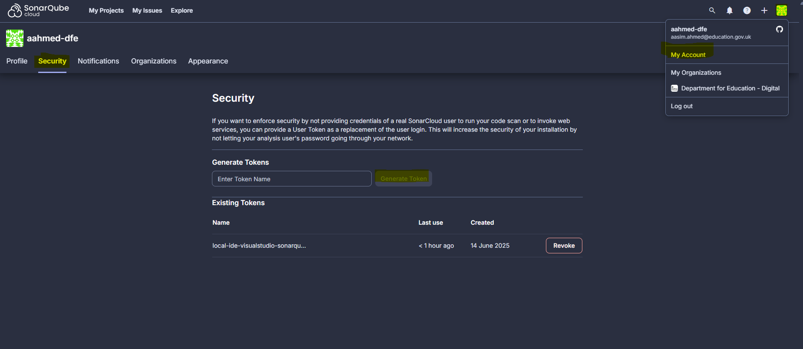
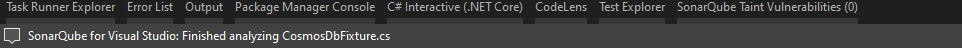
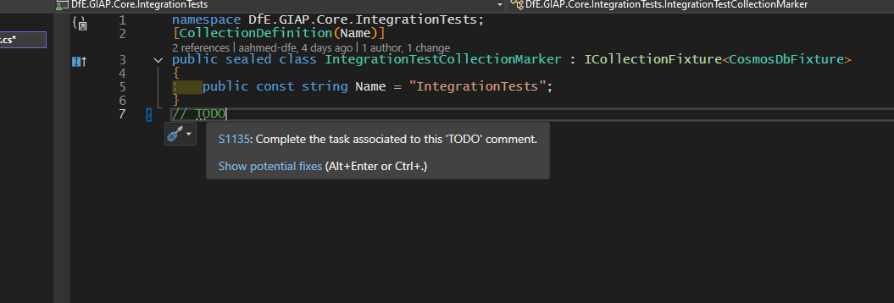
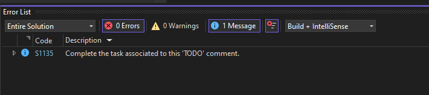

# SonarQube

We use the DFE-Digital managed SonarQube Cloud to perform static code analysis for code smells, duplicated code and other similar issues

## SonarCloud Projects

- [giap-web](https://sonarcloud.io/project/overview?id=DFE-Digital_get-information-about-pupils)

Creating a project in SonarQube is granted through a ServiceNow request to Digital Tools Support (see `#digital-tools-support` in DfE slack)

> CI

- [Setting up SonarQube .NET tool](https://docs.sonarsource.com/sonarqube-cloud/advanced-setup/ci-based-analysis/sonarscanner-for-dotnet/introduction/)
- [Limitations with automatic analysis and why favour the .NET global tool](https://docs.sonarsource.com/sonarqube-cloud/advanced-setup/automatic-analysis/#considerations)

> Local e.g IDE

- [Video explaining how SonarQube works](https://www.youtube.com/watch?v=GRVA4AiO7OM)
- [Connecting SonarQube local to SonarQube cloud](https://docs.sonarsource.com/sonarqube-for-ide/visual-studio/team-features/connected-mode-setup/#sonarqube-cloud)
- [How SonarQube scans local](https://docs.sonarsource.com/sonarqube-for-ide/visual-studio/using/scan-my-project/#scanning-csharp-and-vbnet)

## Getting started

Setup a user account logged in through your DFE-Digital GitHub account which will grant access to the organisations repositories

A `SONAR_TOKEN` is passed to SonarQube as part of CI. We use the the .NET global tool to exercise scans

## Local development

SonarQube provide a [VisualStudio extension](https://docs.sonarsource.com/sonarqube-for-ide/visual-studio/getting-started/installation/).

This can be connected through your IDE using to run analysis based on the same `QualityProfile` and `Issue management` as the SonarQube cloud project
This helps to resolve issues locally that would show up in a scan at PR

As of `2025/06/14` connecting in IDE requires generating a token as a user, providing that to the connection wizard, and binding that to the SonarCloud project

Files are scanned on open by default and should show warning analyzers if issue detected. Insert a // TODO to any file to test the analyser working

